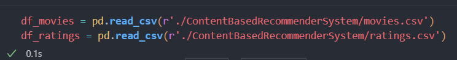
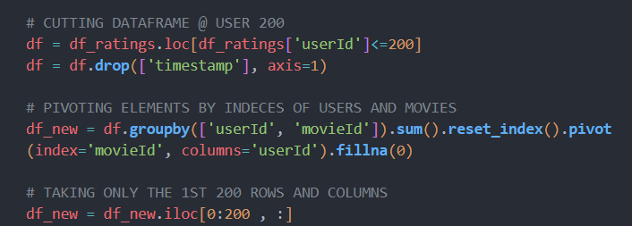
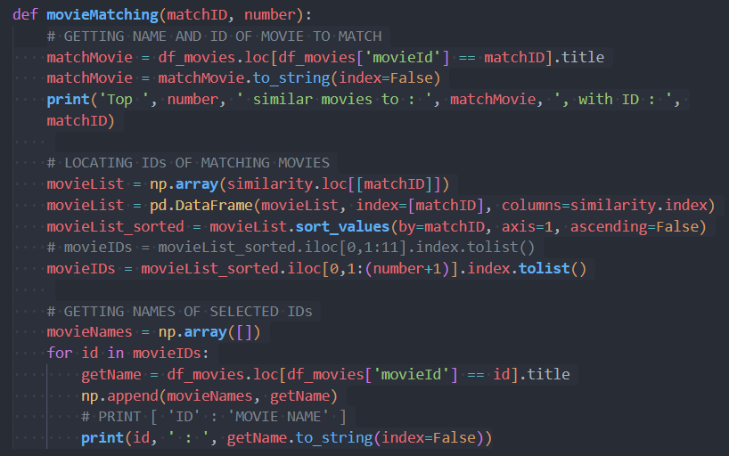
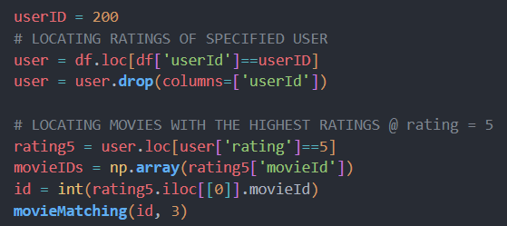
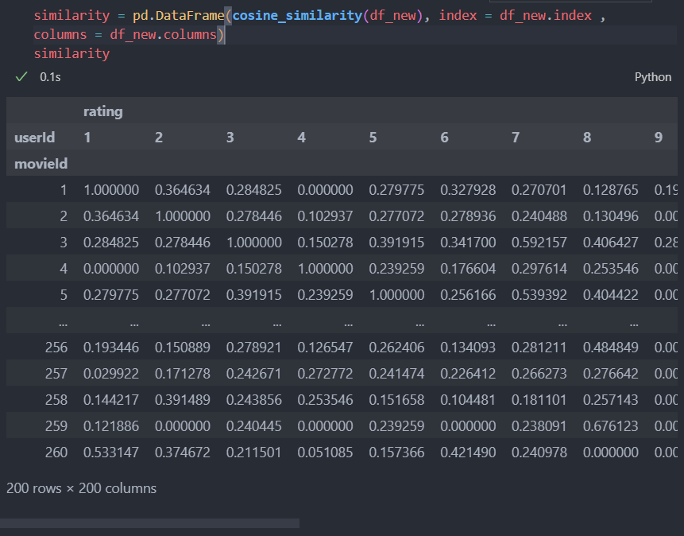
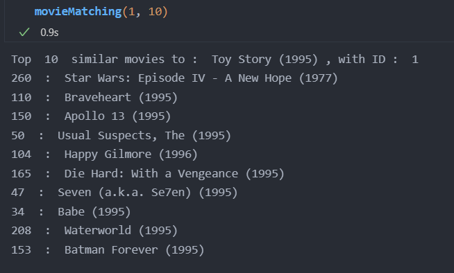
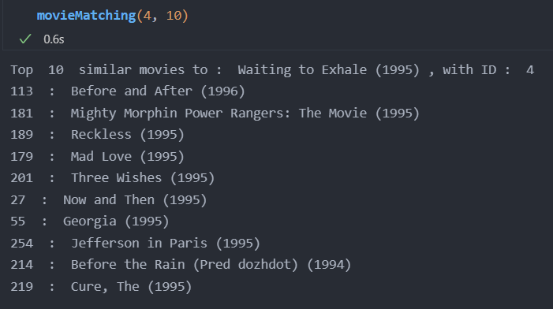
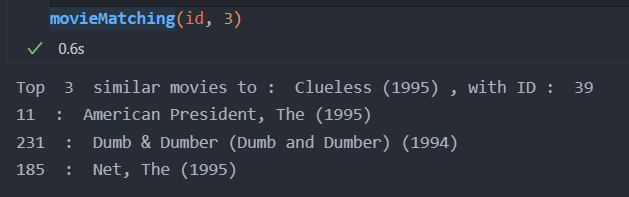

## A7 - RECOMMENDER SYSTEMS
---  

In this assignment, it is required to design a movie recommender system through a database of movie name, genres, users, and their ratings to their watched movies.

  
#### Steps:
_**Base:**_
    1. reading database as dataframs
    
    2. extracting the data only till the 200th user
    3. pivoting the dataframe so that it's easier to read
    4. extracting the data only till the 200th movie
    
_**Similarity:**_
    5. using 'cosine_similarity' function to get the similarities between the movies according to the ratings
    
_**Similar movies:**_
    6. getting the name and ID of the movie required to match
    7. extracting the similarity matrix related to the found ID
    8. locating the IDs of similar movies by sorting the similarity matrix descendingly
    9. taking only the first 11 movies that match _(the first one is the movie we want to match)_
    
_**Movie recommendation:**_
    10. locating the ratings of the specified user
    11. locating the movies rated as 5.0
    12. randomly selecting one of them as a base for recommendation
    13. running the id through the 'Similar movies' function to select 3 similar movies to recommend
    

#### Outputs are as follows:
_similarity matrix_

  
_similar movies_

  
_recommendations_
